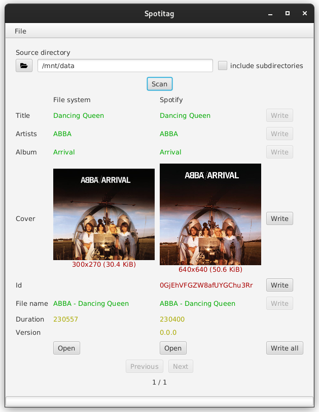

# Spotitag

Easily tag your MP3 files with rich, accurate metadata straight from **Spotify**.

## ✨ What is Spotitag?

Spotitag scans your music library and updates MP3 metadata (title, artist, album, artwork, etc.) using Spotify's database — so your collection looks clean and organized.

---

## 🚀 Quick Start

1. **Register a Spotify API Client**
    - Go to [Spotify Developer Dashboard](https://developer.spotify.com/dashboard/).
    - Create a new application and take note of your **Client ID** and **Client Secret**.

2. **Download Spotitag**
    - Grab the latest `.zip` or `.tar` from the [releases page](https://github.com/dargmuesli/spotitag/releases/latest).
    - Extract the files to your preferred location.

3. **Run Spotitag**
    - **macOS/Linux:** run `bin/spotitag`
    - **Windows:** run `bin/spotitag.bat`

4. **Configure Spotify Credentials**
    - Open Spotitag → `File > Settings`
    - Enter your **Client ID** and **Client Secret**.

5. **Tag Your Music** 🎶
    - Select a folder containing MP3s.
    - Click **Scan** and watch your tags update.

---

## 🛠 Features

- **Skip identical files** — Saves time by ignoring already-matching tracks.
- **Custom property exclusions** — Ignore specific metadata fields when comparing.
- **Duration-based matching** — Ensures accurate song matching.
- **Caching** — Faster rescans and less API usage.

---

## 📚 References & Credits

- **Library:** [spotify-web-api-java](https://github.com/spotify-web-api-java/spotify-web-api-java/)
- **Inspired by:**
    - [radusuciu/id3spot](https://github.com/radusuciu/id3spot/)
    - [FutureSharks/spotify-m3u-import](https://github.com/FutureSharks/spotify-m3u-import/)
    - [louiefb/integrating-local-music-library-to-spotify](https://github.com/louiefb/integrating-local-music-library-to-spotify/)
